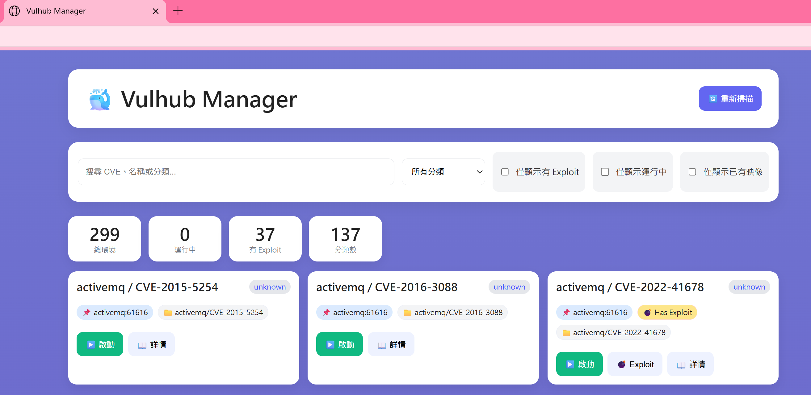
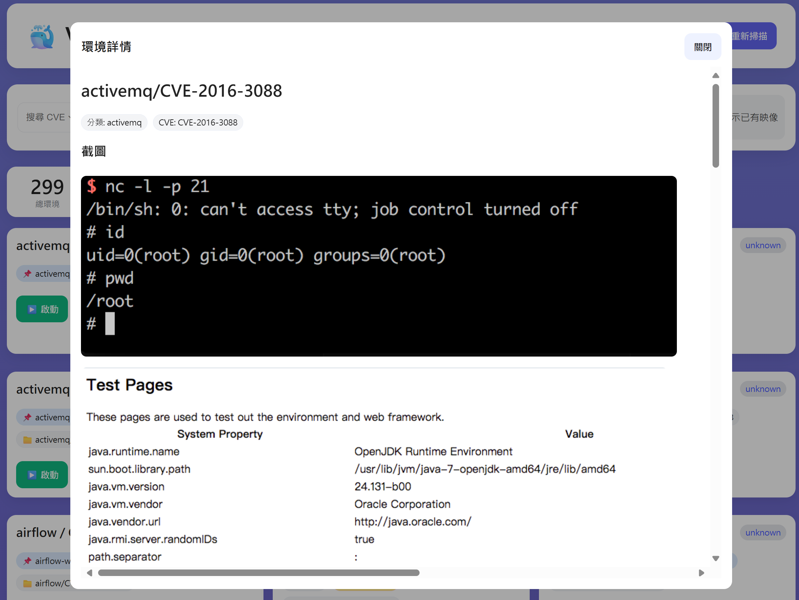
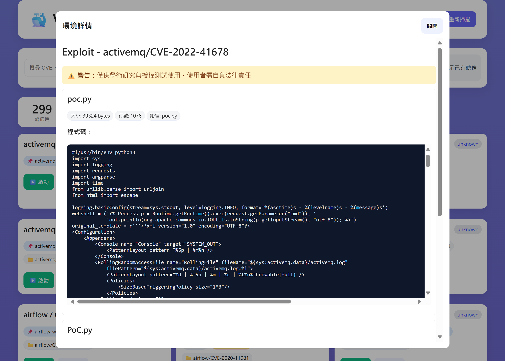
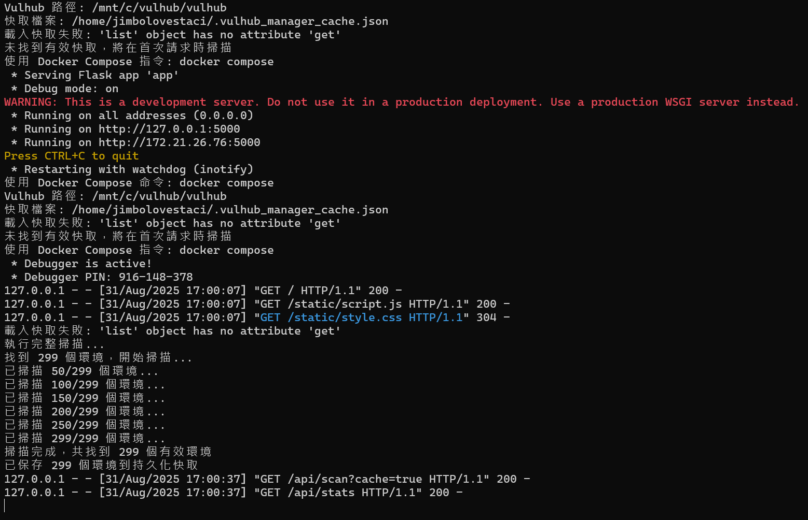
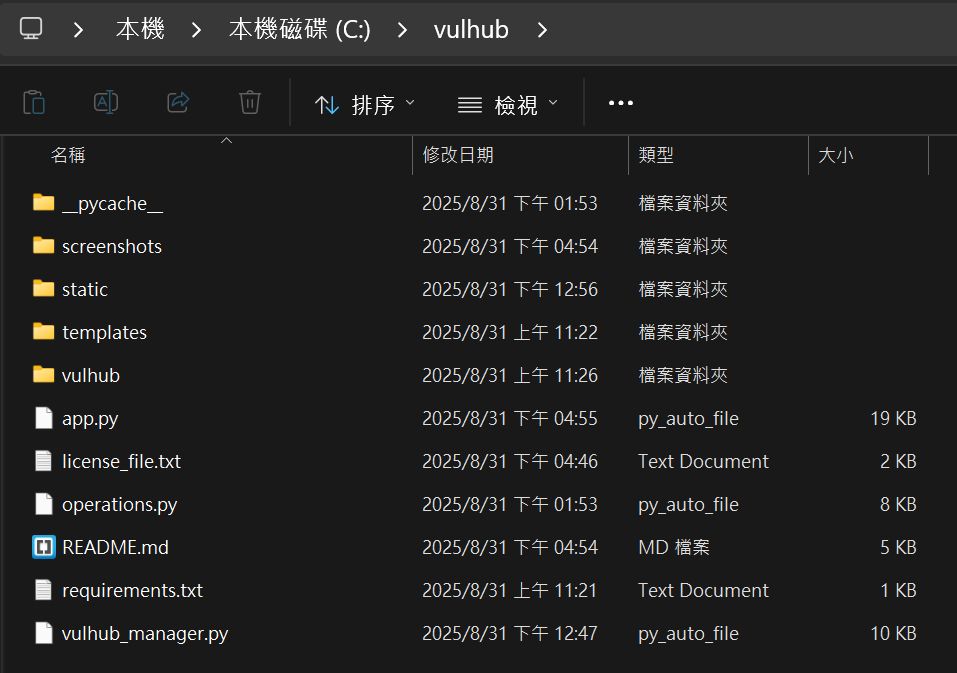
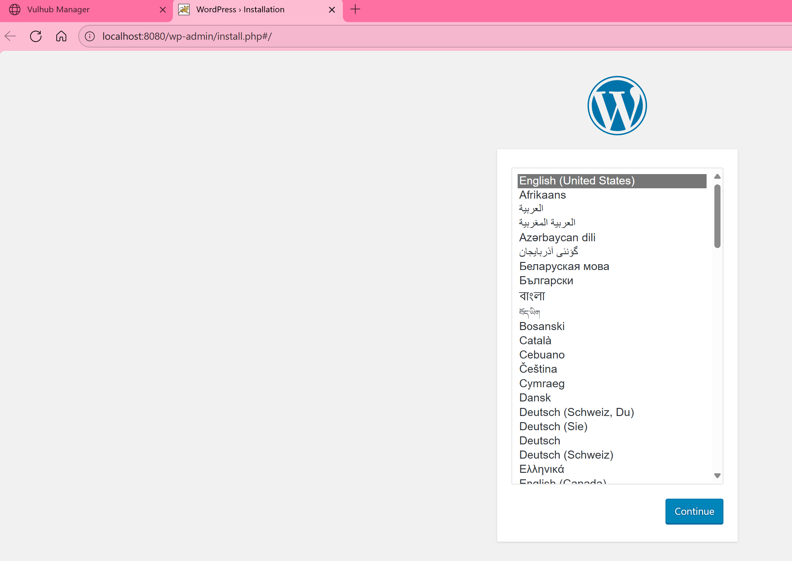

[](http://unmaintained.tech/)

# Vulhub Manager

一個用於管理 [Vulhub](https://github.com/vulhub/vulhub) 漏洞環境的 Web 介面工具。

## ✨ 功能特色

- 🔍 **環境掃描**：自動掃描並列出所有 Vulhub 環境
- 🚀 **一鍵啟停**：輕鬆啟動和停止漏洞環境
- 📦 **映像管理**：自動檢查並下載缺少的 Docker 映像
- 🔎 **智慧篩選**：支援按分類、CVE、Exploit、運行狀態等條件篩選
- 📖 **詳細資訊**：查看環境說明、Docker Compose 配置、截圖等
- 💣 **Exploit 查看**：直接查看和複製 Exploit 程式碼
- 📊 **統計面板**：即時顯示環境統計資訊
- 🌐 **非阻塞操作**：可同時操作多個環境，不會凍結介面

## 📷 介面截圖





## 📋 系統需求

- Python 3.7+
- Docker 與 Docker Compose
- Vulhub 專案（需要先 clone）

## 🚀 快速開始

### 1. Clone 本專案

```bash
git clone https://github.com/ironmancool/vulhub-manager.git
cd vulhub-manager
```

### 2. 安裝依賴

```bash
pip install -r requirements.txt
```

### 3. Clone Vulhub（如果還沒有的話）

```bash
# 可以 clone 在任何地方，之後用 VULHUB_PATH 指定
git clone https://github.com/vulhub/vulhub.git

# 或直接 clone 在專案目錄下（預設位置）
cd vulhub-manager
git clone https://github.com/vulhub/vulhub.git
```

### 4. 設定 Vulhub 路徑

```bash
# 使用環境變數指定 Vulhub 路徑
export VULHUB_PATH=/path/to/your/vulhub

# 或在啟動時指定
VULHUB_PATH=/path/to/your/vulhub python app.py
```

### 5. 啟動服務

```bash
python app.py
```

訪問 http://localhost:5000 即可使用。

## 📁 專案結構

```
vulhub-manager/
├── app.py                 # Flask 主程式
├── operations.py          # Docker 操作邏輯
├── vulhub_manager.py      # 環境管理核心（可選）
├── requirements.txt       # Python 依賴
├── templates/
│   └── index.html        # 主頁面模板
├── static/
│   ├── script.js         # 前端邏輯
│   └── style.css         # 樣式表
└── README.md             # 本文件
```

## 🔧 配置說明

### 環境變數

- `VULHUB_PATH`：Vulhub 專案的路徑（預設：`./vulhub`）
- `PORT`：Web 服務埠號（預設：5000）

### 進階配置

可以修改 `app.py` 中的以下參數：

- `CACHE_TTL_MS`：環境快取時間（預設：24 小時）
- `itemsPerPage`：每頁顯示環境數量（在 `script.js` 中，預設：20）

### 快取機制
- 快取檔案位置：`~/.vulhub_manager_cache.json`
- 自動偵測 Vulhub 變化並重新掃描
- 手動清除快取：刪除快取檔案或點擊「重新掃描」

## 🎯 使用說明

### 基本操作

1. **掃描環境**：首次開啟會自動載入快取，點擊「重新掃描」可重新掃描所有環境
2. **啟動環境**：點擊「▶️ 啟動」按鈕，系統會自動下載缺少的映像並啟動環境
3. **停止環境**：點擊「⏹ 停止」按鈕停止運行中的環境
4. **查看詳情**：點擊「📖 詳情」查看環境的詳細資訊和說明文檔
5. **查看 Exploit**：有 Exploit 的環境會顯示「💣 Exploit」按鈕

### 篩選功能

- **搜尋**：支援按 CVE 編號、環境名稱、分類搜尋
- **分類篩選**：按應用分類篩選（如 nginx、apache、tomcat 等）
- **僅顯示有 Exploit**：只顯示包含 Exploit 的環境
- **僅顯示運行中**：只顯示正在運行的環境  
- **僅顯示已有映像**：只顯示已下載映像的環境

## ⚠️ 安全提醒

1. **僅供學習研究使用**：本工具管理的漏洞環境僅供安全研究和學習使用
2. **隔離環境**：建議在隔離的環境中運行，避免在生產環境使用
3. **訪問控制**：Web 介面預設監聽 0.0.0.0，請注意設定防火牆規則
4. **Exploit 使用**：使用 Exploit 前請確保在合法授權的環境中測試

### 開發環境設置

```bash
# 開發模式運行（自動重載）
flask run --debug

# 或
python app.py  # 已設定 debug=True
```

## 📄 授權協議

MIT License - 詳見 LICENSE 文件

## 🙏 致謝

- [Vulhub](https://github.com/vulhub/vulhub) - 提供豐富的漏洞環境
- Flask - Python Web 框架
- Docker - 容器化平台
- Claude AI - 協助開發

## 📮 聯繫方式

- Email: pcc402@nyu.edu

## 📷 一些使用畫面截圖

### 第一次啟動

### 專案資料夾範例

### 開啟第一個漏洞

### 漏洞介面


---